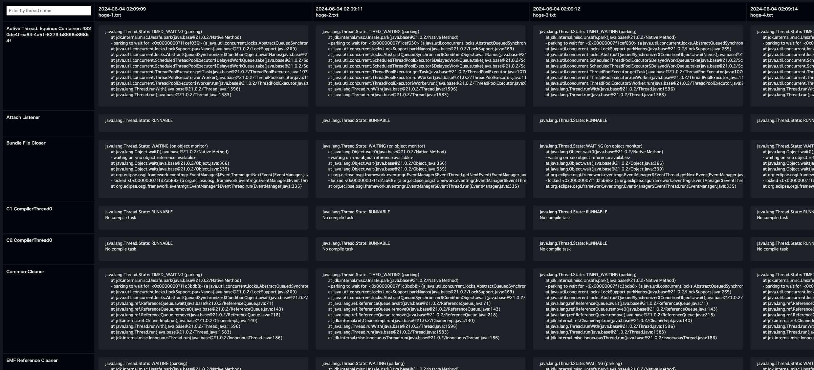

# tdtable

You can view multiple JVM thread dumps in a table layout.



## Usage

```bash
jcmd PID Thread.print > hoge-1.txt
jcmd PID Thread.print > hoge-2.txt
jcmd PID Thread.print > hoge-3.txt

tdtable hoge-*.txt -o out.html
open out.html
```

## Install

### [Download the latest binary](https://github.com/be-hase/tdtable/releases/latest)

Use wget to download, gzipped pre-compiled binaries:

For instance, `BINARY=tdtable_macos_arm64`:

#### Compressed via tar.gz

```bash
wget "https://github.com/be-hase/tdtable/releases/latest/download/$BINARY.tar.gz" -O - | \
  tar xz && mv "$BINARY" /path/to/tdtable
```

#### Plain binary

```bash
wget "https://github.com/be-hase/tdtable/releases/latest/download/$BINARY" \
  -O /path/to/tdtable && \
  chmod +x /path/to/tdtable
```

## Motivation

When investigating using thread dumps, it is common to output multiple times and check for changes in each thread.
Displaying in a table layout makes it easier to examine the changes in each thread.
